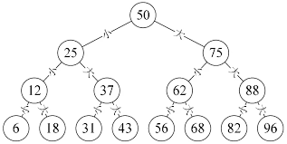

### 二叉树

#### 二叉树特点

* 只有一个根节点
* 树中最多两个分支
* 左侧节点小于父节点,右侧节点大于父节点

#### 二叉树删除规则

* 如果删除节点没有子节点(左侧,右侧都没有节点),直接删除该节点

* 如果删除节点右侧有节点,直接替换该节点为左侧节点

* 如果删除节点左侧有节点,直接替换该节点为右侧节点

* 如果删除节点有左侧节点和右侧节点

   * 方法1: 从待删除节点的左子树找节点值最大的节点A，替换待删除节点，并删除节点A
   * 方法2: 从待删除节点的左子树找节点值最大的节点A，替换待删除节点，并删除节点A

#### 二叉树新增规则

* 如果新增时没有根节点,直接把当前新增节点赋值为root节点
* 新增节点小于当前父节点,直接把当前节点添加到父节点左侧
* 新增节点大于当前父节点,直接把当前节点添加到父节点右侧

#### 二叉数据查询规则

* 查询节点小于父节点,循环左侧节点(递归继续按照这个规则)
* 查询节点大于父节点,循环右侧节点(递归继续按照这个规则)

#### 二叉树遍历方式

* 先序遍历(root -> 左侧 -> 右侧)
* 中序遍历(左侧 -> root -> 右侧)
* 后序遍历(左侧 -> 右侧 -> root)

#### 二叉树查询最大值

* 循环右侧数据

#### 二叉树查询最小值

* 循环左侧数据